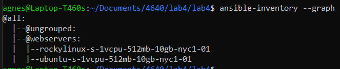

This README file goes over the steps required to use the files in this repo to run Ansible and Podman


1. Setup an Ubuntu 22.04 and Rocky 9 VM in Digital Ocean
2. Assign each VM with the tag "web"
3. Add the Digital Ocean API Token to .profile in the format:
```
export DO_API_TOKEN=<your token>
```
4. Check everything is working with ansible with the command
```bash
ansible -m ping -u root all -i <private key>
```
5. After setup run this command
```bash
ansible-inventory --graph
```


6. Run the nginx and user creation playbooks with the command:
```bash
ansible-playbook nginx_setup.yml -u root
ansible-playbook user_setup.yml -u root
```

7. Run the podman playbook with the command:
```bash
ansible-playbook podman_setup.yml -u ansible_user
